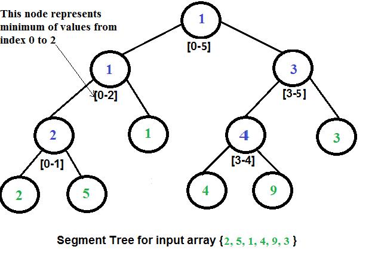
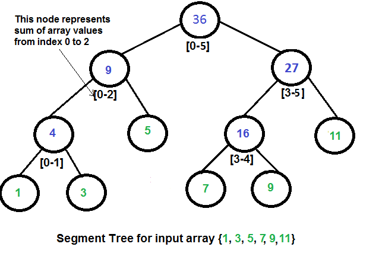

在计算机科学中，线段树 (segment tree) 也被称为统计树 (statistic tree)，用于存储 区间(intervals) 或线段(segments) 。该数据结构允许快速查询结构内包含某一点的所有区间。它是一种静态的结构，也就是一旦构造后就不能修改。

线段树主要用于数组进行某些操作，特别是区间查询(range queries)。应用领域有 计算几何 和 地理信息系统。

线段树是二叉树，根节点表示整个数组。左右子节点分别表示数组的各半。子树递推定义。

从底往上构建线段树，时间复杂度为 `O(n log n)`, n 为输入元素数量(数组长度)，范围查询时间复杂度为 `O(log n)`

