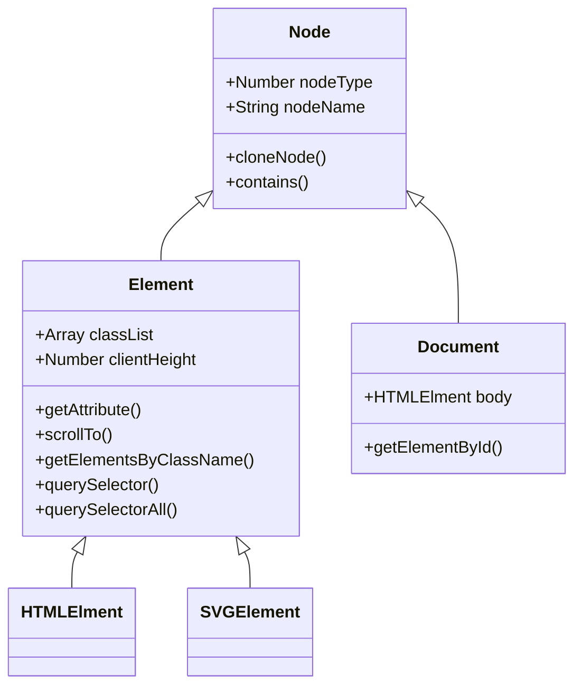

## 概述

Document 和 Element 继承自接口 Node。
所有 Document 对象下的对象都继承自 Element，包括 HTMLElement 和 SVGElement。

HTMLElment 接口是所有 HTML 元素的基本接口，而 SVGElement 接口是所有 SVG 元素的基础。



> 不列出全部方法&属性&事件，只列举部分，下同

## 节点 Node

### 属性

- nodeType
- nodeName

```js
const img = document.createElement('img')
img.nodeName
// 'IMG'
img.nodeType
// 1
```

> nodeType 为 1，说明是 ELEMENT_NODE，还有其他节点类型，比如文本节点 3 (TEXT_NODE)，注释节点 8 (COMMENT_NODE) 等。

- firstChild
- lastChild
- previousSibling
- nextSibling
- parentNode
- childNodes: 该节点所有子节点的实时的 `NodeList`

### 方法

- `cloneNode()`: 接受一个布尔值参数，表示是否执行深复制。在参数为 true 的情况下，执行深复制，也就是复制节点及其整个子节点树；在参数为 false 的情况下，执行浅复制，即只复制节点本身。
- `contains()`: 判断传入的节点是否是自己的后代。
- `appendChild()`
- `removeChild()`
- `replaceChild()`

## Element

### 属性

- classList
- className
- clientHeight
- clientLeft
- innerHTML
- Element.classList：只读属性，返回一个元素的类属性的实时 `DOMTokenList`集合
  - **add( String [, String] )**：添加指定的类值。如果这些类已经存在于元素的属性中，那么它们将被忽略。
  - **remove( String [,String] )**：删除指定的类值。
  - **item** ( Number )：按集合中的索引返回类值。
  - **toggle** ( String [, force] )：当只有一个参数时：切换 class value; 即如果类存在，则删除它并返回 false，如果不存在，则添加它并返回 true。当存在第二个参数时：如果第二个参数的计算结果为 true，则添加指定的类值，如果计算结果为 false，则删除它
  - contains( String )：检查元素的类属性中是否存在指定的类值。
- outerHTML：在读模式下， outerHTML 返回调用它的元素及所有子节点的 HTML 标签。在写模式下，outerHTML 会根据指定的 HTML 字符串创建新的 DOM 子树，然后用这个 DOM 子树完全替换调用元素

```js
div.outerHTML = '<p>This is a paragraph.</p>'
// 等价于
var p = document.createElement('p')
p.appendChild(document.createTextNode('This is a paragraph.'))
div.parentNode.replaceChild(p, div)
```

### 方法

- `removeAttribute()`
- `scrollTo()`
- `querySelector()`: 返回匹配的第 1 个元素/null
- `querySelectorAll()`
- `getBoundingClientRect()`
- `getElementsByClassName()`
  - 返回一个数组，其中包含类名为 class 的所有元素。还可以查找那些怒**带有多个类名** 的元素，要指定多个类名，只要在字符串参数中用**空格分割类名**即可。Eg. `document.getElementsByClassName("important sale")` 获得同时带有"important" 和"sale"的元素。
- `getAttribute()`，通过使用`.属性名`达到`getAttribute(属性名)`的效果

```js
var source = somePic.getAttribute('href')
var sameSource = somePic.href
```

> 当链接是绝对地址时，两者等价。当链接是相对地址时，somePic.href 会将相对地址转换为绝对地址。而 getAttribute('href')则依旧返回标签里的 href 属性，不做任何改变

- `getBoundingClientRect()` 方法，包含 4 个属性： left 、 top 、 right 和 bottom。这些属性给出了元素在页面中相对于视口的位置，不管有没有进行设置

### 元素大小


## Document

`Document` 接口描述了任何类型的文档的通用属性与方法。根据不同的文档类型（例如 HTML、XML、SVG，...），还能使用更多 API：使用 `"text/html"` 作为内容类型（content type）的 HTML 文档，还实现了 `HTMLDocument` 接口，而 XML 和 SVG 文档则（额外）实现了 `XMLDocument` 接口。

### 属性

- `Document.body`
- `Document.hidden`

#### HTMLDocument 的扩展

- `Document.documentElement`获取的是`<html>`结点
- `Document.cookie`
- `Document.domain`
- `Document.location`
- `Document.title`
- `Document.readyState`：当这个属性的值变化时，document 对象上的`readystatechange` 事件将被触发
  - loading ：`document`仍在加载
  - interactive：文档已经完成加载，文档已被解析，但是诸如图像，样式表和框架之类的子资源仍在加载。
  - complete：文档和所有子资源已完成加载。状态表示 `load` 事件即将被触发。
- `document.hasFocus()` 方法，用于确定文档是否获得了焦点，失去页面焦点就会变为 false（失去焦点包括：离开当前页面，点击搜索栏，焦点在控制面板里）

#### 自定义数据属性

```html
<div id="myDiv" data-myname="Nicholas" data-appid="12345"></div>
```

获取自定义属性的值

```js
const div = document.getElementById('myDiv')
//取得自定义属性的值
const myName = div.dataset.myname
const appId = div.dataset.appid
```

### 事件

- `Document.onreadystatechange`
- `Document.onvisibilitychange`

## Other

### 追加 className

```js
if (!elem.className) {
  elem.className = 'other-class'
} else {
  elem.className += ' other-class'
}
```

### 获取修改元素样式：`elem.style`

```js
document.querySelector('.container').style.background = 'blue'
document.querySelector('.container').style = 'background:blue;width: 400px;'
```

将所有改变合并在一起执行，只修改 DOM 一次。可通过使用 cssText 属性实现：

```js
var el = document.getElementById('mydiv')
el.style.cssText = 'border-left: 1px; border-right: 2px; padding: 5px;'
```

### 使用特定容器元素进行包装的问题元素

- `<option>` and `< optgroup>` need to be contained in a `<select multiple="multiple">...</select>`
- `<legend>` needs to be contained in a `<fieldset>...</fieldset>`
- `<thead>` , `< tbody>` , `< tfoot>` , `< colgroup>` , and `< caption>` need to be contained in a`<table>...</table>`
- `<tr>` needs to be in a `<table><thead>...</thead></table>` , `<table><tbody>...</tbody></table>` , or `<table><tfoot>...</tfoot></table>`
- `<td>` and `<th>` need to be in a `<table><tbody><tr>...</tr></tbody></table>`
- `<col>` must be in a `<table><tbody></tbody><colgroup>...</colgroup></table>`
- `<link>` and `<script>` need to be in a `<div></div><div>...</div>`

> https://developer.mozilla.org/zh-CN/docs/Web/API/Node
>
> https://developer.mozilla.org/zh-CN/docs/Web/API/Element
>
> https://developer.mozilla.org/zh-CN/docs/Web/API/Document
